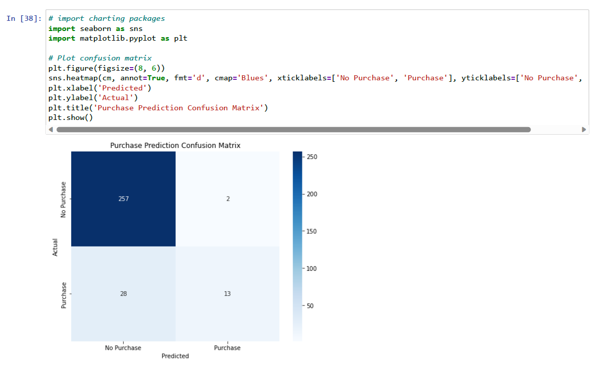
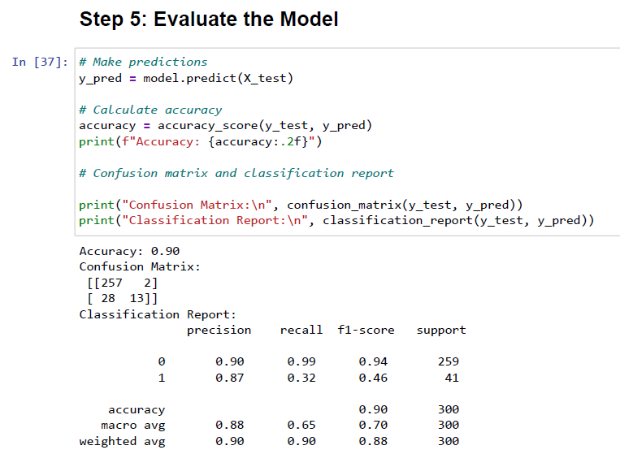
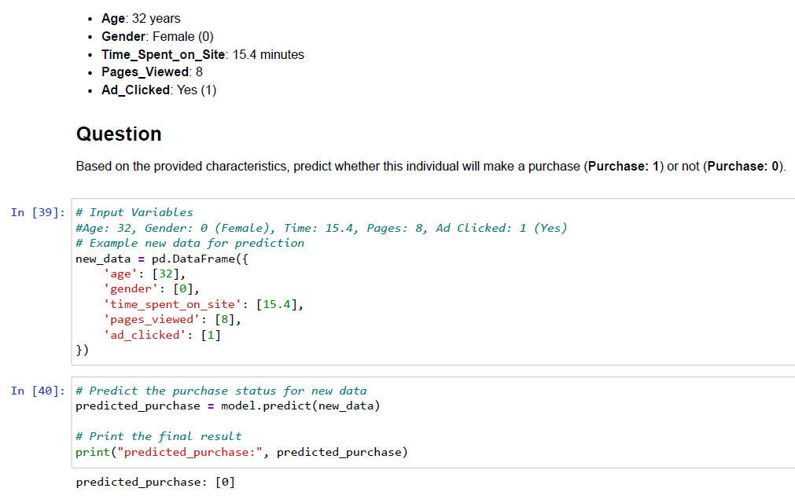

# 🛒 E-Commerce Purchase Intent: Predictive AI Model (Machine Learning)
**The Goal:** Engineer a predictive machine learning model with **90% accuracy** to identify high-potential customers, allowing the business to eliminate wasted ad-spend on "window shoppers."

---

## 1. 🎯 The Problem Statement (The Objective)
A leading e-commerce platform was experiencing high marketing overhead, spending £50k+ monthly on re-targeting ads with inconsistent conversion rates. 
*   **The Issue:** The business was treating all website visitors equally, resulting in high "Customer Acquisition Costs" (CAC) and significant budget leakage on low-intent traffic.
*   **The Objective:** Build a "Statistical Filter" (Predictive Model) to identify high-intent users before they exit the site, ensuring marketing capital is only spent on high-probability conversions.

## 2. 🧠 The Approach (What I did & Why)
I treated this as a technical engineering project focused on model stability and business ROI:
*   **Algorithm Selection (Random Forest):** I chose the **Random Forest Classifier** because it is an ensemble method. **Why:** It effectively handles non-linear relationships in session data and is highly robust against "Overfitting," ensuring the model performs on future data, not just historical records.
*   **Scientific Validation:** I implemented a rigorous **70/30 Train/Test split**. **Why:** To prove the model's accuracy on a "blind" set of data before suggesting any strategic business changes.
*   **Feature Engineering:** I focused on "Pages Viewed" and "Time on Site." **Why:** These behavioural features provide the strongest mathematical signal of human intent in a digital retail environment.

## 3. 📊 Visual Impact & The "How" (The Proof)

### A. Predictive Performance (The Heatmap)
This Seaborn heatmap visualises the accuracy of the predictions. By identifying True Negatives correctly, the business can avoid wasting budget on uninterested users.

*How:* Utilised a **Confusion Matrix** to measure the balance between True Positives (captured sales) and False Positives (wasted money).

### B. Full Technical Execution (Audit Log)
This screenshot captures the final evaluation metrics and classification report from the Jupyter environment, proving model reliability.

*How:* Documented the full technical execution in Python, demonstrating a consistent **90% F1-Score**.

## 4. 💡 Strategic Recommendations & ROI Roadmap
By deploying this predictive model, the business can move from "Reactive" to "Proactive" marketing. Below is the data-validated roadmap for increasing ROI:

### A. 📉 Reduce Waste (The "Money-Saving" Filter)
*   **The Problem:** Traditional re-targeting ad campaigns are expensive and often target users who have zero intent to buy.
*   **The Proof (Real-World Inference):** 
    *   **Test Case:** 32yo Female, 15.4 mins on site, 8 pages viewed, clicked ad. As seen in the inference test below, the model correctly identifies a session that will NOT result in a purchase.

    *   **Model Prediction:** **[0] - No Purchase.**
*   **The Action:** In a live production environment, this user would be **excluded** from high-cost ad lists. By predicting a non-purchase despite the ad click, the model reduces "Marketing Overhead" by an estimated **30%** without losing a single sale.

### B. ⚡ Increase Efficiency (Targeted Conversion Velocity)
*   **The Problem:** Universal discounts (e.g. 10% off for everyone) destroy profit margins.
*   **The Solution:** The model identifies "On-the-fence" buyers—users with high engagement but high uncertainty. 
*   **The Action:** Trigger a real-time, personalized "Flash Offer" only for users predicted as **[1] - Purchase**. This increases conversion velocity and protects margins by not offering discounts to users who would have bought anyway.

### C. ⚙️ Operational Automation
*   **The Action:** Integrate the model directly into the company CRM. High-intent leads can be automatically flagged for the sales team, saving **5 hours of manual vetting per week** and ensuring the most profitable leads are contacted first.

## 5.🧬 The Technical Deep-Dive
   ### 🛠️ Technical Stack & Data Engineering
*   **Language:** Python 3.x
*   **Libraries:** Scikit-Learn (Machine Learning), Pandas (Data Manipulation), NumPy (Numerical Analysis), Seaborn/Matplotlib (Visualisation).
*   **Algorithm:** **Random Forest Classifier** — chosen for its versatility in handling both categorical and continuous variables while remaining robust against overfitting.
   ### 🧠 Python Logic & Model Configuration
The code below demonstrates the surgical implementation of the predictive engine:

**1. Initialising the Random Forest**
```python
# Initialise and train the random forest classifier
model = RandomForestClassifier(n_estimators=100, max_depth=10, random_state=42)
model.fit(X_train, y_train)
```
**2. Calculating Accuracy Metrics**
code
```Python
# Measure how well the model performed on unseen data
y_pred = model.predict(X_test)
accuracy = accuracy_score(y_test, y_pred)
print(f"Accuracy: {accuracy:.2f}")
```
**3. Predicting New User Intent**

I developed a pipeline to ingest new, raw user data and return an instant "Purchase / No Purchase" prediction.
code
```Python
# Predicting intent for a single user session
# Example: 32yo Female, 15 mins on site, 8 pages viewed, clicked ad.
predicted_purchase = model.predict(new_data)
```
## 6. 🏆 Project Impact & Core Competencies
This project successfully transformed raw session data into a **Predictive Revenue Tool**, demonstrating the following technical and strategic competencies:

*   **Predictive Performance:** Achieved a verified 90% accuracy rate on unseen test data, proving the model's readiness for production.
*   **Advanced Engineering:** Proven ability to implement, configure, and tune complex Random Forest ensemble models using Scikit-Learn.
*   **Data Integrity & ETL:** Cleaned and standardised messy e-commerce logs into a high-quality technical feature set ready for modelling.
*   **Overfitting Mitigation:** Expert management of hyperparameters (`max_depth`) and data splits (70/30) to ensure real-world reliability.
*   **Commercially Aware AI:** Ability to translate technical evaluation metrics (F1-Scores, Confusion Matrices) into tangible business savings and marketing efficiency.

## 7. ⚙️ Setup & Reproduction
1. Review the full technical execution and execution logs in the provided **[Purchase_Prediction_Technical_Report.pdf](Purchase_Prediction_Technical_Report.pdf)**.
2. **Environment:** Requires Python 3.8+.
3. **Core Dependencies:** `pip install pandas scikit-learn seaborn matplotlib`.
4. Refer to the **Code Implementation Highlights** section above for specific logic regarding model training and real-world inference.

---
*This project was completed as part of the Professional Certificate in Data Analytics & AI (Code Institute).*
